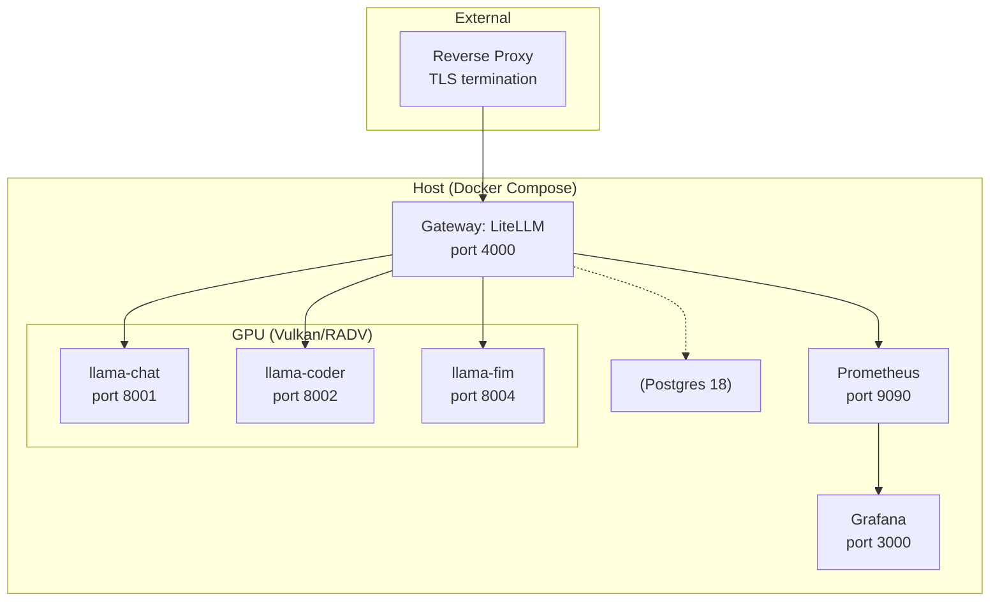

# AI Stack


Self-hosted LLM inference stack: local model **Backends** exposed through a single
**Gateway**, with optional **Imagegen Mode** (ComfyUI) and optional
Grafana/Prometheus monitoring. See [`CONTEXT.md`](CONTEXT.md) for glossary
(Backend, Gateway, Model ID, Key, ...) and [`docs/adr/`](docs/adr/) for
architecture decisions.

## Why

This is my tinkering project around the [Framework Desktop Mainboard
(AMD Ryzen AI Max 300 series)](https://frame.work/de/de/products/framework-desktop-mainboard-amd-ryzen-ai-max-300-series?v=FRAFMK0006).
I'm getting hands-on experience running and serving local models, learning
as I go, and continuously improving the stack. Mostly for fun.

### Hardware

- Board/APU: Framework Desktop Mainboard, AMD Ryzen AI Max 395, 128GB RAM
- Case: Inter-Tech IPC Server 3U-3098-S
- Fan: Noctua NF-A12x25 PWM, 120x120x25mm, 450-2000 RPM, 22.6 dB(A), brown/beige
- PSU: be quiet! Power Zone 2 Modular, 750W, 80+ Platinum
- Storage: Lexar NQ790 1TB, M.2 2280, PCIe 4.0 x4, 3D NAND

## Architecture



Gateway is LAN-facing on `:4000` (reverse proxy terminates TLS, forwards
`/v1/*`). Postgres (Keys/spend) is internal only. Everything else —
Backends, ComfyUI, Prometheus — binds `127.0.0.1` only.

## Setup

1. `make env` (copies `.env.example` to `.env`) and fill in:
   - `LITELLM_MASTER_KEY`: `echo "sk-$(openssl rand -hex 32)"`
   - `POSTGRES_PASSWORD`, `GRAFANA_ADMIN_PASSWORD`: strong random values
   - `MODELS_DIR`, `CHAT_MODEL_FILE`, `CODER_MODEL_FILE`, `FIM_MODEL_FILE`,
     `RENDER_GID`, `VIDEO_GID`: see [Backends](#backends)
2. `make up`

`make help` lists shortcuts (`up`/`down`/`logs`/`ps`/`config`/`vulkaninfo`/
`stats`/`monitoring`/`test`/...). On podman, pass
`COMPOSE="podman compose" CONTAINER_BIN=podman` to any target.

## Backends

Defined in `docker-compose.backends.yml`, kept separate from
`docker-compose.yml` since they're host-specific (GPU device, group IDs,
model paths). Pinned to llama.cpp build **b9570** — b9592+ ships a broken
`libggml-vulkan.so` that silently falls back to CPU.

| Model ID | Port | Model | Notes |
|---|---|---|---|
| `llama-chat` | 8001 | `Ornith-1.0-35B` ([HF](https://huggingface.co/deepreinforce-ai/Ornith-1.0-35B-GGUF)) | general chat/reasoning, `--parallel 2` (two ~131k slots) |
| `llama-coder` | 8002 | `Qwen3.6-35B-A3B` MTP ([HF](https://huggingface.co/unsloth/Qwen3.6-35B-A3B-MTP-GGUF)) | coding, self-speculative decoding + vision encoder, `--parallel 1` (MTP needs a single slot) |
| `llama-fim` | 8004 | small base model (`FIM_MODEL_FILE`), e.g. `qwen2.5-coder-1.5b-base` | fill-in-the-middle, raw `/v1/completions`, no chat template |

Model ID stays a stable alias so Clients/Keys don't change when the
underlying model is swapped. Both big Backends run `ctx-size 262144` with
f16 KV cache (commented `q8_0` lines halve VRAM if needed — ADR 0002);
`llama-fim` runs a small 8k slot. `make stats` measures actual usage.

### Models

Place GGUF files under `MODELS_DIR` (mounted read-only) and point
`CHAT_MODEL_FILE`/`CODER_MODEL_FILE`/`FIM_MODEL_FILE` at them. For
sharded models, point at the first shard (`model-00001-of-000XX.gguf`).

The multimodal projector belongs to `llama-coder` (`CODER_MMPROJ_FILE`,
Qwen3.6's vision encoder). `llama-chat` (Ornith) is text-only; its
`--mmproj`/`CHAT_MMPROJ_FILE` lines stay commented for a future swap back
to Qwen3.6. `llama-fim` needs no projector.

### GPU passthrough GIDs

```sh
getent group render | cut -d: -f3
getent group video | cut -d: -f3
```

Set as `RENDER_GID`/`VIDEO_GID` in `.env`.

### Bring-up order

1. `make vulkaninfo` — should list the gfx1151 RADV device (ADR 0003).
2. `docker compose up -d llama-chat`, test `http://127.0.0.1:8001/v1/chat/completions`.
3. `docker compose up -d llama-coder`, test `http://127.0.0.1:8002/v1/chat/completions`.
4. `docker compose up -d llama-fim`, test `http://127.0.0.1:8004/v1/completions` (raw FIM prompt).
5. `docker compose up -d` for the rest (litellm, postgres). Monitoring
   is layered on separately, see [Monitoring](#monitoring).

### Imagegen Mode (ComfyUI)

Planned mode where ComfyUI runs (LAN-facing, port 8188) and both Backends'
context shrinks to 32k to free memory for diffusion weights. Switching it
on/off restarts the Backends. See ADR 0004 (ComfyUI over `stable-diffusion.cpp`
for OpenWebUI's native image-gen dialogs). Not yet wired into the compose stack.

## Monitoring

Optional, defined in `docker-compose.monitoring.yml` (kept out of the
default `COMPOSE_FILE`):

```sh
make monitoring        # bring up
make monitoring-down   # tear down
```

- Grafana: LAN-facing `:3000`, login `admin` / `GRAFANA_ADMIN_PASSWORD`,
  Prometheus datasource pre-provisioned.
- Prometheus: `127.0.0.1:9090`, scrapes litellm's `/metrics` (request count,
  latency, errors per Model ID/Key).

## Issuing Keys

```sh
curl -X POST http://<host>:4000/key/generate \
  -H "Authorization: Bearer $LITELLM_MASTER_KEY" \
  -H "Content-Type: application/json" \
  -d '{
    "models": ["llama-chat", "llama-coder", "llama-fim"],
    "rpm_limit": 60,
    "tpm_limit": 100000
  }'
```

`<host>` is the machine's LAN IP. `models` restricts the Key to those Model
IDs (others get 401/403); `rpm_limit`/`tpm_limit` are optional per-Key rate
limits. The response's `key` (`sk-...`) is the Client credential. Revoke
with `POST /key/delete`, inspect with `GET /key/info?key=...`.

## Tests

```sh
make test
```

Brings up litellm + Postgres + Prometheus + Grafana alongside stub Backends
(`docker-compose.test.yml`) and runs `tests/*.bats` against them.

## Special thanks

* [kyuzo](https://github.com/Kyuz0) for the inspiration
* [Wendel, and Level1Techs](https://level1techs.com/) for the inspiration
* [litellm](https://github.com/BerriAI/litellm) for the gateway
* [lama.cpp](https://github.com/ggml-org/llama.cpp) for the great work


## Additional info
_you might see a sync of my private gitlab repo_
