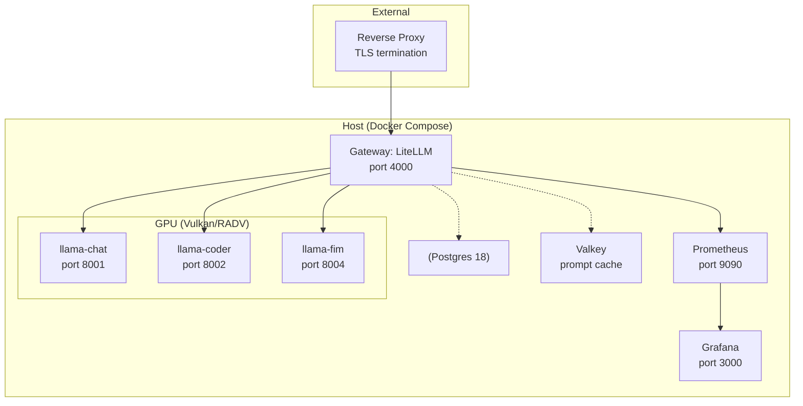

# AI Stack

A self-hosted LLM inference stack: local model **Backends** exposed through a single
**Gateway**, with optional **Imagegen Mode** (ComfyUI) and optional
Grafana/Prometheus monitoring. See [`CONTEXT.md`](CONTEXT.md) for the glossary
(Backend, Gateway, Model ID, Key, …) and [`docs/adr/`](docs/adr/) for
architecture decisions.

## Architecture



## Setup

1. `make env` (copies `.env.example` to `.env`) and fill in real values:
   - `LITELLM_MASTER_KEY`: `echo "sk-$(openssl rand -hex 32)"`
   - `POSTGRES_PASSWORD`: any strong random value
   - `VALKEY_PASSWORD`: any strong random value (prompt cache, see
     [Prompt caching](#prompt-caching-experimental-testvalkey-prompt-cache))
   - `GRAFANA_ADMIN_PASSWORD`: any strong random value
   - `MODELS_DIR`, `QWEN35_MODEL_FILE`, `CODER_MODEL_FILE`, `FIM_MODEL_FILE`,
     `RENDER_GID`, `VIDEO_GID`: see [Backends](#backends)
2. `make up`

The Gateway (litellm) is LAN-facing on `:4000` (see ADR 0001); the reverse proxy
terminates TLS and forwards `/v1/*` to it. Postgres (virtual Keys / spend
tracking) and Valkey (prompt cache) back litellm and are not exposed outside the
compose network.

All other components — Backends, ComfyUI, Prometheus — bind `127.0.0.1` only.

Run `make help` for shortcuts to the commands used throughout this doc
(`up`/`down`/`logs`/`ps`/`config`/`vulkaninfo`/`stats`/`monitoring`/`test`/...).
On a podman host, pass `COMPOSE="podman compose" CONTAINER_BIN=podman` to any
target.

## Backends

Three Backends are defined in `docker-compose.backends.yml`:

- `llama-chat` (Model ID `llama-chat`, `:8001`, currently serving
  `Ornith-1.0-35B`) — general chat/reasoning.
- `llama-coder` (Model ID `llama-coder`, `:8002`, currently serving
  `Qwen3.6-35B-A3B`) — coding, with MTP self-speculative decoding.
- `llama-fim` (Model ID `llama-fim`, `:8004`, small base model) —
  fill-in-the-middle autocomplete for editors (e.g. Zed's Edit Prediction),
  served on the raw `/v1/completions` route with no chat template.

They're kept separate from `docker-compose.yml` because they're host-specific
(GPU device, group IDs, model paths) — see ADR 0003 for Vulkan/RADV vs. ROCm
and ADR 0002 for the KV cache settings. The Backends pin to llama.cpp build
**b9570** because builds b9592+ ship a broken `libggml-vulkan.so` that silently
falls back to CPU — see comments in `docker-compose.backends.yml`.

`.env.example` sets
`COMPOSE_FILE=docker-compose.yml:docker-compose.backends.yml` so plain
docker compose up -d includes them; `tests/run.sh` is unaffected since it
passes `-f` explicitly and overlays stub Backends instead (see
[Tests](#tests)).

Slot layout differs per Backend: `llama-chat` runs **`--parallel 2`**, so its
`ctx-size 262144` splits across two ~131k slots; `llama-coder` runs
**`--parallel 1`** (MTP requires a single slot), giving one full 262k slot;
`llama-fim` runs a single small 8k-context slot.

### Models

Place the GGUF files under `MODELS_DIR` (e.g. `~/models`, mounted read-only
into the Backends) and point `QWEN35_MODEL_FILE`/`CODER_MODEL_FILE`/`FIM_MODEL_FILE`
at their paths within it (subdirectories are fine). For a model split into multiple
shards, point at the first shard (`model-00001-of-000XX.gguf`) — llama.cpp finds
the rest automatically.

**Current models:**

The Model ID stays a stable functional alias (`llama-chat`/`llama-coder`) so
Clients and Keys don't change when the underlying model is swapped:

| Model ID | Underlying model | Hugging Face |
|---|---|---|
| `llama-chat` | `Ornith-1.0-35B` | [deepreinforce-ai/Ornith-1.0-35B-GGUF](https://huggingface.co/deepreinforce-ai/Ornith-1.0-35B-GGUF) — agentic-coding reasoning model (MIT), post-trained on Gemma 4 & Qwen 3.5 via self-improving RL framework |
| `llama-coder` | `Qwen3.6-35B-A3B` (MTP) | [unsloth/Qwen3.6-35B-A3B-MTP-GGUF](https://huggingface.co/unsloth/Qwen3.6-35B-A3B-MTP-GGUF) — 35B MoE (A3B active) with a bundled MTP head for self-speculative decoding and a vision encoder |
| `llama-fim` | small base model (`FIM_MODEL_FILE`) | e.g. a `qwen2.5-coder-1.5b-base` GGUF — a base (non-instruct) model for fill-in-the-middle completions |

The multimodal projector now belongs to `llama-coder`: it loads
`CODER_MMPROJ_FILE` via `--mmproj` (Qwen3.6's vision encoder), giving it the
"Multimodal" capability from `CONTEXT.md`. `llama-chat` (Ornith) has no vision
encoder and runs text-only — its `--mmproj`/`QWEN35_MMPROJ_FILE` lines stay
commented, ready for a swap back to Qwen3.6. `llama-fim` needs no projector.

### GPU passthrough GIDs

`RENDER_GID`/`VIDEO_GID` are the host's `render`/`video` group IDs, added to
each Backend container via `group_add` alongside `/dev/dri` passthrough:

```sh
getent group render | cut -d: -f3
getent group video | cut -d: -f3
```

### Bring-up order

Per the original hardware plan (`planed-setup.md`), bring the Backends up
incrementally rather than all at once:

1. Verify Vulkan passthrough before starting either Backend: `make vulkaninfo`
   should list the gfx1151 RADV device (ADR 0003). If `vulkaninfo` isn't in
   the image, `apt-get install -y vulkan-tools` in a one-off shell on the same
   image first.
2. `docker compose up -d llama-chat`, then send a chat completion to
   `http://127.0.0.1:8001/v1/chat/completions` (issue #2 acceptance check).
3. `docker compose up -d llama-coder`, then send a chat completion to
   `http://127.0.0.1:8002/v1/chat/completions` (issue #3 acceptance check).
4. `docker compose up -d llama-fim`, then send a `/v1/completions` request to
   `http://127.0.0.1:8004/v1/completions` (raw FIM prompt, no chat template).
5. `docker compose up -d` for the rest of the stack (litellm, postgres, valkey).
   Optional Grafana/Prometheus monitoring is layered on separately, see
   [Monitoring](#monitoring).

### Imagegen Mode (ComfyUI)

Imagegen Mode (see `CONTEXT.md`) is a planned operating mode where ComfyUI runs
(LAN-facing on port 8188) and both Backends' context shrinks to 32k to free
memory for diffusion weights. Switching it on/off restarts the Backends, briefly
interrupting any connected Client. See ADR 0004 for the rationale — ComfyUI is
preferred despite likely requiring ROCm, because OpenWebUI has native image-gen
dialogs for it (and none for `stable-diffusion.cpp`). Not yet part of the compose
stack; the mode still needs to be wired up.

### Memory budget

`llama-chat` and `llama-coder` both run **ctx-size 262144** with an **f16 KV
cache** (the q8_0 `--cache-type-k`/`-v` lines are present but commented in both,
so either can be re-enabled to halve KV VRAM — ADR 0002):

- `llama-chat`: 262k split across two ~131k slots (`--parallel 2`).
- `llama-coder`: one full 262k slot (`--parallel 1`, required by MTP).
- `llama-fim`: a single small 8k slot — negligible next to the two big models.

`planed-setup.md` estimates ~90GB combined at 65k/f16 — with two models at 256k
f16 plus the small FIM model, that budget is tight. To measure:
`make stats` (covers all three Backends). To change a context window, edit
`--ctx-size` in `docker-compose.backends.yml`, restart that Backend, and
re-measure.

## Prompt caching (experimental, `test/valkey-prompt-cache`)

`valkey` (a Redis fork) backs LiteLLM's exact-match request cache
(`litellm_settings.cache_params` in `litellm/config.yaml`): identical
`/v1/chat/completions` requests (same model, messages, and sampling params)
are served straight from Valkey instead of round-tripping to a Backend.
Set `VALKEY_PASSWORD` in `.env`.

This is a test-branch experiment, not yet a settled decision — at this
scale (single user/few friends, free local inference) exact-prompt cache
hits are expected to be rare in normal chat/coding use, since the benefit
mainly shows up with repeated identical prompts (e.g. shared system
prompts, embeddings). See `tests/caching.bats` for a functional check.

## Monitoring

Grafana/Prometheus are optional and defined in `docker-compose.monitoring.yml`,
kept out of the default `COMPOSE_FILE` so `make up` doesn't roll them out.
Add them on top of the running stack with:

```sh
make monitoring
```

(`make monitoring-down` stops and removes just these two services.)

- Grafana is LAN-facing on `:3000` (log in as `admin` / `GRAFANA_ADMIN_PASSWORD`).
  A Prometheus datasource is pre-provisioned at `http://prometheus:9090`
  (`grafana/provisioning/datasources/prometheus.yml`) and healthy on first boot.
- Prometheus is Localhost-only on `127.0.0.1:9090` and scrapes litellm's
  `/metrics` endpoint (`litellm/config.yaml` enables the `prometheus` callback
  and sets `require_auth_for_metrics_endpoint: false`), giving request count,
  latency, and error metrics per Model ID/Key.

## Issuing Keys

Generate a Key for a Client, scoped to specific Model IDs:

```sh
curl -X POST http://<host>:4000/key/generate \
  -H "Authorization: Bearer $LITELLM_MASTER_KEY" \
  -H "Content-Type: application/json" \
  -d '{
    "models": ["llama-chat", "llama-coder", "llama-fim"],
    "rpm_limit": 60,
    "tpm_limit": 100000
  }'
```

The Gateway is LAN-facing, so `http://<host>` is the machine's LAN IP when
calling from other devices. The Master Key lives in `.env` (`LITELLM_MASTER_KEY`);
it is referenced by litellm via `os.environ/LITELLM_MASTER_KEY`.

- `models`: restricts the Key to these Model IDs; requests for any other
  Model ID are rejected (401/403).
- `rpm_limit` / `tpm_limit`: optional per-Key rate limits (requests/tokens
  per minute). Omit for no limit.

The response's `key` field (`sk-...`) is the Client's credential. Revoke with
`POST /key/delete`, inspect with `GET /key/info?key=...`.

## Tests

```sh
make test
```

Brings up litellm + Postgres + Prometheus + Grafana alongside stub Backends
(standing in for `llama-chat`/`llama-coder`, see `docker-compose.test.yml`)
and runs the test suites (`tests/*.bats`) against them.
