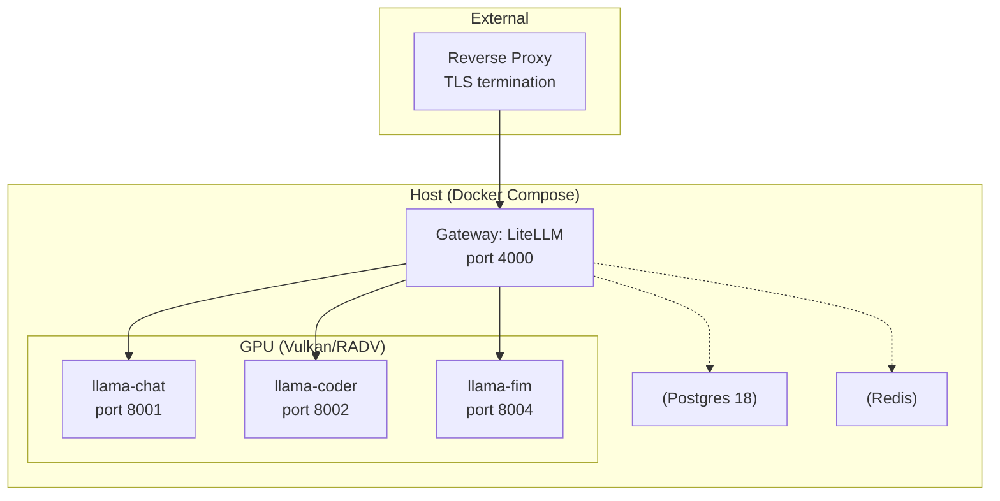

# AI Stack


Self-hosted LLM inference stack: local model **Backends** exposed through a single
**Gateway**. See [`CONTEXT.md`](CONTEXT.md) for glossary
(Backend, Gateway, Model ID, Key, ...) and [`docs/adr/decisions.md`](docs/adr/decisions.md)
for architecture decisions.

## Motivation

This is my tinkering project around the [Framework Desktop Mainboard
(AMD Ryzen AI Max 300 series)](https://frame.work/de/de/products/framework-desktop-mainboard-amd-ryzen-ai-max-300-series?v=FRAFMK0006).
I'm getting hands-on experience running and serving local models, learning
as I go, and continuously improving the stack. Mostly for fun.

### Hardware

- Board/APU: Framework Desktop Mainboard, AMD Ryzen AI Max 395, 128GB RAM
- Case: Inter-Tech IPC Server 3U-3098-S
- Fan: Noctua NF-A12x25 PWM, 120x120x25mm, 450-2000 RPM, 22.6 dB(A), brown/beige
- PSU: be quiet! Power Zone 2 Modular, 750W, 80+ Platinum
- Storage: Lexar NQ790 1TB, M.2 2280, PCIe 4.0 x4, 3D NAND

## Technical Details

### Architecture


```mermaid
graph TD
    subgraph "External"
        RP["Reverse Proxy\nTLS termination"]
    end

    subgraph "Host (Docker Compose)"
        GW["Gateway: LiteLLM\nport 4000"]
        PG["(Postgres 18)"]
        RD["(Redis)"]
        L1["llama-chat\nport 8001"]
        L2["llama-coder\nport 8002"]
        L3["llama-fim\nport 8004"]

        subgraph "GPU (Vulkan/RADV)"
            L1
            L2
            L3
        end
    end

    RP --> GW
    GW --> L1
    GW --> L2
    GW --> L3
    GW -.-> PG
    GW -.-> RD
```

Gateway is LAN-facing on `:4000` (reverse proxy terminates TLS, forwards
`/v1/*`). Postgres (Keys/spend) and Redis (response cache, rate-limit and
budget counters, router state) are internal only, with no published port at
all. Everything else — the Backends — binds `127.0.0.1` only.

Postgres is the system of record; Redis is not. Losing the Redis volume costs
a cold response cache and reset rate-limit counters, nothing durable. LiteLLM
has warned since v1.98.0 when it runs without Redis, because every one of
those is otherwise per-worker — see
[Redis requirements](https://docs.litellm.ai/docs/proxy/redis_requirements)
and [ADR 0007](docs/adr/decisions.md#adr-0007--redis-for-gateway-shared-state-even-though-this-runs-a-single-worker).

### Setup

1. `make env` (copies `.env.example` to `.env`) and fill in:
   - `LITELLM_MASTER_KEY`: `echo "sk-$(openssl rand -hex 32)"`
   - `POSTGRES_PASSWORD`, `REDIS_PASSWORD`: strong
     random values (`openssl rand -hex 32`)
   - `MODELS_DIR`, `CHAT_MODEL_FILE`, `CODER_MODEL_FILE`, `FIM_MODEL_FILE`,
     `RENDER_GID`, `VIDEO_GID`: see [Backends](#backends)
2. `make up`

`make help` lists shortcuts (`up`/`down`/`logs`/`ps`/`config`/`vulkaninfo`/
`stats`/`test`/...). On podman, pass
`COMPOSE="podman compose" CONTAINER_BIN=podman` to any target.

### Backends

Defined in `docker-compose.backends.yml`, kept separate from
`docker-compose.yml` since they're host-specific (GPU device, group IDs,
model paths). Pinned to a specific llama.cpp `server-vulkan` build
(currently **b10438**; the tag is maintained by Renovate). The pin — rather
than `latest` — dates back to builds b9592–~b9744, which shipped a broken
`libggml-vulkan.so` that silently falls back to CPU; if a future bump
misbehaves, check that library shipped intact before debugging elsewhere.

| Model ID | Port | Model | Notes |
|---|---|---|---|
| `llama-chat` | 8001 | `KAT-Coder-V2.5-Dev-MTP` ([HF](https://huggingface.co/gbuzhf/KAT-Coder-V2.5-Dev-MTP-GGUF)) | general chat/reasoning, 512k ctx, `--parallel 4` (four ~131k slots), MTP self-speculative decoding. No vision projector currently set |
| `llama-coder` | 8002 | `Qwen3.6-35B-A3B`, MoE ([HF](https://huggingface.co/unsloth/Qwen3.6-35B-A3B-MTP-GGUF)) | coding, `--parallel 2` (two 256k slots), MTP self-speculative decoding (draft n-max 3) — MTP drops out once a second stream is generating, kept on anyway for the single-stream case; vision (`--mmproj`) |
| `llama-fim` | 8004 | `FIM_MODEL_FILE`, currently `MiniCPM5-2B` ([HF](https://huggingface.co/bartowski/MiniCPM5-2B-GGUF)) | fill-in-the-middle, raw `/v1/completions`, no chat template. Prefix-Suffix-Middle FIM order (llama.cpp default, no `--spm-infill`) — Clients must send `<\|fim_prefix\|>{prefix}<\|fim_suffix\|>{suffix}<\|fim_middle\|>` |

Model ID stays a stable alias so Clients/Keys don't change when the
underlying model is swapped. All three Backends use a q8_0-quantized KV
cache, halving KV VRAM vs. the f16 default (ADR 0002): `llama-chat` at
`ctx-size 524288` (4 × ~131k slots), `llama-coder` at `ctx-size 524288`
(2 × 256k slots), `llama-fim` an 8k slot, single parallel stream. `make
stats` measures actual usage.

#### Memory budget

All three Backends run `--load-mode mlock` (with `ulimits.memlock: -1`),
pinning model pages in RAM so the unified-memory iGPU never has to fault
weights back in from disk. Weights plus KV caches for all three Backends
share this host's 128 GB pool — `make stats` snapshots the real
per-container memory/CPU usage (model sizes change often enough that a
hardcoded figure here would just go stale).

`.env.example` sets `COMPOSE_FILE=docker-compose.yml:docker-compose.backends.yml`
so plain `docker compose up -d` includes them; `tests/run.sh` is unaffected
since it passes `-f` explicitly and overlays stub Backends (see
[Tests](#tests)).

#### Models

Place GGUF files under `MODELS_DIR` (mounted read-only) and point
`CHAT_MODEL_FILE`/`CODER_MODEL_FILE`/`FIM_MODEL_FILE` at them. For
sharded models, point at the first shard (`model-00001-of-000XX.gguf`).

Only `llama-coder` currently runs with `--mmproj` for image input:
`Qwen3.6-35B-A3B` ships its own vision projector in the same HF repo as
the base model, set via `CODER_MMPROJ_FILE`. It's an MoE/hybrid
architecture running q8_0 KV cache — the interaction between quantized KV
and multimodal inference there is unverified, see ADR 0002 (originally
written about `llama-chat` running that same combination; the concern
carries over to whichever Backend actually pairs vision with a
quantized-KV MoE/hybrid model). `llama-chat`'s `CHAT_MMPROJ_FILE` is
unset/commented in `.env.example` since its current model ships no
projector; `llama-fim` needs no projector either way.

In practice, multimodal has run more reliably on the smaller, MoE model
here than it did on the larger dense one — small-parameter MoE seems to
tolerate vision + quantized KV better than a large dense model does, at
least anecdotally so far. For a single dense model instead of splitting
chat/coder/FIM across three Backends, see the `feat/halogen-backend`
branch (its `docs/adr/0009-halogen-backend-strix-halo.md`, not present on
`main`): it drops llama.cpp entirely for `halogen-flash-server`
(`ghcr.io/peonist-ai/halogen-flash-server`), a closed-source engine built
for exactly this GPU (gfx1151), serving one consolidated `Qwen3.8`-based
model. Vision exists there too but is off by default
(`HALOGEN_VISION_TOWER`) — the small-vs-large vision tradeoff moves, it
doesn't disappear.

#### GPU passthrough GIDs

```sh
getent group render | cut -d: -f3
getent group video | cut -d: -f3
```

Set as `RENDER_GID`/`VIDEO_GID` in `.env`.

#### Host kernel parameters (GTT)

Strix Halo has no dedicated VRAM partition — the iGPU addresses system RAM
through the Graphics Translation Table (GTT). Without a large-enough GTT
window, the Vulkan driver only sees a few GB and large models fail to load
or abort mid-load, independent of anything in the compose files. This host
is booted with (`/proc/cmdline`):

```
amd_iommu=off amdgpu.gttsize=131072 ttm.pages_limit=33554432
```

`amdgpu.gttsize` is in MiB (131072 = 128 GiB, this host's full RAM — GTT is
an addressing limit, not a hard reservation, so sizing it to total RAM is
safe). `ttm.pages_limit` must cover at least the same amount in 4 KiB pages
(33554432 × 4 KiB = 128 GiB) or large allocations fail even with a big
`gttsize`. `amd_iommu=off` trades IOMMU protection for ~5–12% throughput on
this platform ([kyuz0/amd-strix-halo-toolboxes issue #66](https://github.com/kyuz0/amd-strix-halo-toolboxes/issues/66));
reasonable to accept on a single-tenant home host, worth reconsidering on a
shared one. Set via the `GRUB_CMDLINE_LINUX_DEFAULT` kernel line and
`grub2-mkconfig`/`update-grub`, then reboot — this only needs doing once
per machine, not per container.

#### Bring-up order

1. `make vulkaninfo` — should list the gfx1151 RADV device (ADR 0003).
2. `docker compose up -d llama-chat`, test `http://127.0.0.1:8001/v1/chat/completions`.
3. `docker compose up -d llama-coder`, test `http://127.0.0.1:8002/v1/chat/completions`.
4. `docker compose up -d llama-fim`, test `http://127.0.0.1:8004/v1/completions` (raw FIM prompt).
5. `docker compose up -d` for the rest (litellm, postgres, redis).

### Issuing Keys

```sh
curl -X POST http://<host>:4000/key/generate \
  -H "Authorization: Bearer $LITELLM_MASTER_KEY" \
  -H "Content-Type: application/json" \
  -d '{
    "models": ["llama-chat", "llama-coder", "llama-fim"],
    "rpm_limit": 60,
    "tpm_limit": 100000
  }'
```

`<host>` is the machine's LAN IP. `models` restricts the Key to those Model
IDs (others get 401/403); `rpm_limit`/`tpm_limit` are optional per-Key rate
limits. The response's `key` (`sk-...`) is the Client credential. Revoke
with `POST /key/delete`, inspect with `GET /key/info?key=...`.

### Tests

```sh
make test
```

Brings up litellm + Postgres + Redis alongside stub
Backends (`docker-compose.test.yml`) and runs `tests/*.bats` against them.
Requires [bats](https://github.com/bats-core/bats-core) on `PATH`.

The suite runs in its own compose project (`-p ai-stack-test`) on a remapped
localhost port (4100), so it is safe to run while the real stack
is up — its teardown is `down -v`, which under the default project name would
delete the live Postgres/Redis volumes.

## Acknowledgements

* [Kyuz0](https://github.com/Kyuz0) for the inspiration
* [Wendel, and Level1Techs](https://level1techs.com/) for the inspiration
* [litellm](https://github.com/BerriAI/litellm) for the gateway
* [lama.cpp](https://github.com/ggml-org/llama.cpp) for the great work

_you might see a sync of my private gitlab repo_
