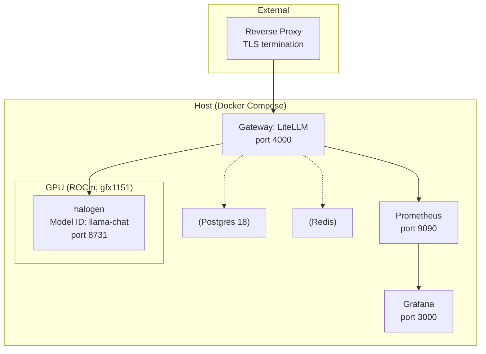

# AI Stack


Self-hosted LLM inference stack: local model **Backends** exposed through a single
**Gateway**, with optional **Imagegen Mode** (ComfyUI) and optional
Grafana/Prometheus monitoring. See [`CONTEXT.md`](CONTEXT.md) for glossary
(Backend, Gateway, Model ID, Key, ...) and [`docs/adr/`](docs/adr/) for
architecture decisions.

## Motivation

This is my tinkering project around the [Framework Desktop Mainboard
(AMD Ryzen AI Max 300 series)](https://frame.work/de/de/products/framework-desktop-mainboard-amd-ryzen-ai-max-300-series?v=FRAFMK0006).
I'm getting hands-on experience running and serving local models, learning
as I go, and continuously improving the stack. Mostly for fun.

### Hardware

- Board/APU: Framework Desktop Mainboard, AMD Ryzen AI Max 395, 128GB RAM
- Case: Inter-Tech IPC Server 3U-3098-S
- Fan: Noctua NF-A12x25 PWM, 120x120x25mm, 450-2000 RPM, 22.6 dB(A), brown/beige
- PSU: be quiet! Power Zone 2 Modular, 750W, 80+ Platinum
- Storage: Lexar NQ790 1TB, M.2 2280, PCIe 4.0 x4, 3D NAND

## Technical Details

### Architecture


```mermaid
graph TD
    subgraph "External"
        RP["Reverse Proxy\nTLS termination"]
    end

    subgraph "Host (Docker Compose)"
        GW["Gateway: LiteLLM\nport 4000"]
        PG["(Postgres 18)"]
        RD["(Redis)"]
        L1["halogen\nModel ID: llama-chat\nport 8731"]
        PM["Prometheus\nport 9090"]
        GF["Grafana\nport 3000"]

        subgraph "GPU (ROCm, gfx1151)"
            L1
        end
    end

    RP --> GW
    GW --> L1
    GW -.-> PG
    GW -.-> RD
    GW --> PM
    PM --> GF
```

Gateway is LAN-facing on `:4000` (reverse proxy terminates TLS, forwards
`/v1/*`). Postgres (Keys/spend) and Redis (response cache, rate-limit and
budget counters, router state) are internal only, with no published port at
all. Everything else — Backends, ComfyUI, Prometheus — binds `127.0.0.1` only.

Postgres is the system of record; Redis is not. Losing the Redis volume costs
a cold response cache and reset rate-limit counters, nothing durable. LiteLLM
has warned since v1.98.0 when it runs without Redis, because every one of
those is otherwise per-worker — see
[Redis requirements](https://docs.litellm.ai/docs/proxy/redis_requirements)
and [ADR 0007](docs/adr/0007-redis-for-gateway-shared-state.md).

### Setup

1. `make env` (copies `.env.example` to `.env`) and fill in:
   - `LITELLM_MASTER_KEY`: `echo "sk-$(openssl rand -hex 32)"`
   - `POSTGRES_PASSWORD`, `REDIS_PASSWORD`, `GRAFANA_ADMIN_PASSWORD`: strong
     random values (`openssl rand -hex 32`)
   - `HALOGEN_MODELS_DIR`, `RENDER_GID`, `VIDEO_GID`: see
     [Backend](#backend)
2. `make halogen-fetch` — pulls ~127 GB of weights. Resumable, and worth
   starting before anything else.
3. `make up`

`make help` lists shortcuts (`up`/`down`/`logs`/`ps`/`config`/
`halogen-fetch`/`halogen-health`/`stats`/`monitoring`/`test`/...). On podman, pass
`COMPOSE="podman compose" CONTAINER_BIN=podman` to any target.

### Backend

One Backend, defined in `docker-compose.backends-halogen.yml` and kept
separate from `docker-compose.yml` since it's host-specific (GPU devices,
group IDs, model path). It runs
[halogen-flash-server](https://github.com/peonist-ai/halogen-flash-server),
a closed-source inference engine written for this exact GPU — gfx1151, which
it hard-rejects anything else for — serving the one model that loads in it.
See [ADR 0009](docs/adr/0009-halogen-backend-strix-halo.md) for why the three
llama.cpp Backends collapsed into this, and what that cost.

Unlike llama.cpp's Vulkan/RADV path (ADR 0003), this is ROCm: it needs
`/dev/kfd` in addition to `/dev/dri`.

| Model ID | Port | Model | Notes |
|---|---|---|---|
| `llama-chat` | 8731 | `halogen-qwen3.8-flash-next` ([HF](https://huggingface.co/peonist-ai/halogen-qwen3.8-flash-next)) | general chat/reasoning/coding, 256k native ctx from one shared KV pool, speculative decode (~41 tok/s single stream, ~34 serial), prompt cache. Vision ships beside the weights but is off (`HALOGEN_VISION_TOWER`) |

The Model ID stays `llama-chat` so Clients and Keys survive the swap, even
though nothing behind it is llama.cpp anymore; `HALOGEN_MODEL_ID` makes the
Backend report the same id. **`llama-coder` and `llama-fim` no longer exist**
— halogen serves one model and has no infill endpoint, so FIM autocomplete
has no replacement here and Clients pointed at those Model IDs get a 400.

`HALOGEN_CTX` bounds a single request; `HALOGEN_KV_POOL_POSITIONS` is the
memory knob. Positions come from one pool shared across conversations rather
than llama.cpp's per-slot `--ctx-size / --parallel` split, which is why
`max_input_tokens` in `litellm/config.yaml` is the full 262144.

`make halogen-health` is authoritative over any of the above: it reports what
the running build actually accepts — sampling fields, whether images are
taken, token budget aliases and defaults, tool-call wire format.

#### Memory budget

halogen wants the machine to itself. What it reports at boot on this host:

```
memory: 68.0 GiB of weights locked in RAM, 7.2 GiB of KV pool,
        21.1 GiB of working memory, 96.3 GiB in all
host memory left for everything else: 16.8 GiB total
```

`HALOGEN_KV_POOL_POSITIONS` is at `262144` because the engine refuses
upstream's `524288` default at startup and lowers itself to this anyway. Be
aware that the guard doing the refusing is an estimate its own measured
figures contradict — it calls 262144 "~27.8 GiB" while reserving 7.2 GiB —
so the larger pool may actually fit. Untested here. Imagegen Mode still layers
ComfyUI's diffusion weights on top (see
[Imagegen Mode](#imagegen-mode-comfyui)) — expect to stop the Backend rather
than shrink it.

If it won't start, or long prompts crawl with the disk busy, halve
`HALOGEN_MAX_TOK` to `16384` next.

`make stats` snapshots per-container usage, but do not read it on its own:
the kernel counts halogen's locked weights as reclaimable file cache, so
`free(1)` and `MemAvailable` both under-report by roughly the size of the
model. The startup log line *"host memory left for everything else"* is the
one to trust.

#### Host tuning

This host already boots with `amd_iommu=off` (worth 13–16% prefill on this
GPU) and a sized `amdgpu.gttsize` / `ttm.pages_limit`. Upstream's reference
machine additionally passes `amdgpu.vm_update_mode=0 amdgpu.noretry=0
amdgpu.sg_display=0`, which this host does not — untested here, and not
required to start. Upstream also notes a large iGPU carve-out in BIOS buys
nothing and costs file cache; set it to Auto or the ~512 MiB minimum.

### Monitoring

Optional, defined in `docker-compose.monitoring.yml` (kept out of the
default `COMPOSE_FILE`):

```sh
make monitoring        # bring up
make monitoring-down   # tear down
```

- Grafana: LAN-facing `:3000`, login `admin` / `GRAFANA_ADMIN_PASSWORD`,
  Prometheus datasource pre-provisioned.
- Prometheus: `127.0.0.1:9090`, scrapes litellm's `/metrics` (request count,
  latency, errors per Model ID/Key).

### Dark mode

Optional, defined in `docker-compose.darkmode.yml` (kept out of the default
`COMPOSE_FILE`). Patches the litellm dashboard's static export for dark mode
via [delorenj/litellm-dark-mode](https://github.com/delorenj/litellm-dark-mode)
and builds a local `litellm-dark-mode:local` image from the pinned base:

```sh
make darkmode-up       # build litellm-dark-mode:local and start with it
make darkmode-down     # switch back to the pinned upstream image
```

`make darkmode` alone just (re)builds the image. Rerun it after bumping the
litellm base image in `docker-compose.yml`.

### Issuing Keys

```sh
curl -X POST http://<host>:4000/key/generate \
  -H "Authorization: Bearer $LITELLM_MASTER_KEY" \
  -H "Content-Type: application/json" \
  -d '{
    "models": ["llama-chat"],
    "rpm_limit": 60,
    "tpm_limit": 100000
  }'
```

`<host>` is the machine's LAN IP. `models` restricts the Key to those Model
IDs (others get 401/403) — there is only one since ADR 0009, but scoping a Key
to it explicitly still beats an unscoped Key, and keeps working if a second
Backend ever returns; `rpm_limit`/`tpm_limit` are optional per-Key rate
limits. The response's `key` (`sk-...`) is the Client credential. Revoke
with `POST /key/delete`, inspect with `GET /key/info?key=...`.

### Tests

```sh
make test
```

Brings up litellm + Postgres + Redis + Prometheus + Grafana alongside stub
Backends (`docker-compose.test.yml`) and runs `tests/*.bats` against them.
Requires [bats](https://github.com/bats-core/bats-core) on `PATH`.

The suite runs in its own compose project (`-p ai-stack-test`) on remapped
localhost ports (4100/9190/3100), so it is safe to run while the real stack
is up — its teardown is `down -v`, which under the default project name would
delete the live Postgres/Redis/Grafana volumes.

## Acknowledgements

* [Kyuz0](https://github.com/Kyuz0) for the inspiration
* [Wendel, and Level1Techs](https://level1techs.com/) for the inspiration
* [litellm](https://github.com/BerriAI/litellm) for the gateway
* [lama.cpp](https://github.com/ggml-org/llama.cpp) for the great work

_you might see a sync of my private gitlab repo_
