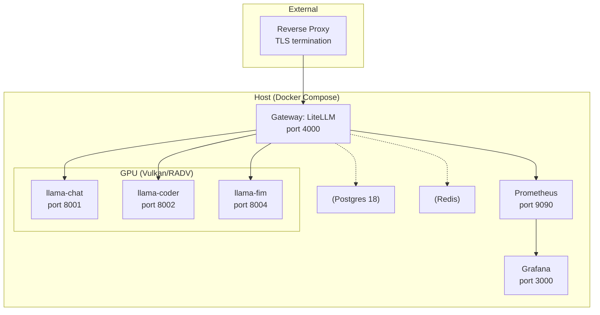

# AI Stack


Self-hosted LLM inference stack: local model **Backends** exposed through a single
**Gateway**, with optional **Imagegen Mode** (ComfyUI) and optional
Grafana/Prometheus monitoring. See [`CONTEXT.md`](CONTEXT.md) for glossary
(Backend, Gateway, Model ID, Key, ...) and [`docs/adr/`](docs/adr/) for
architecture decisions.

## Motivation

This is my tinkering project around the [Framework Desktop Mainboard
(AMD Ryzen AI Max 300 series)](https://frame.work/de/de/products/framework-desktop-mainboard-amd-ryzen-ai-max-300-series?v=FRAFMK0006).
I'm getting hands-on experience running and serving local models, learning
as I go, and continuously improving the stack. Mostly for fun.

### Hardware

- Board/APU: Framework Desktop Mainboard, AMD Ryzen AI Max 395, 128GB RAM
- Case: Inter-Tech IPC Server 3U-3098-S
- Fan: Noctua NF-A12x25 PWM, 120x120x25mm, 450-2000 RPM, 22.6 dB(A), brown/beige
- PSU: be quiet! Power Zone 2 Modular, 750W, 80+ Platinum
- Storage: Lexar NQ790 1TB, M.2 2280, PCIe 4.0 x4, 3D NAND

## Technical Details

### Architecture


```mermaid
graph TD
    subgraph "External"
        RP["Reverse Proxy\nTLS termination"]
    end

    subgraph "Host (Docker Compose)"
        GW["Gateway: LiteLLM\nport 4000"]
        PG["(Postgres 18)"]
        RD["(Redis)"]
        L1["llama-chat\nport 8001"]
        L2["llama-coder\nport 8002"]
        L3["llama-fim\nport 8004"]
        PM["Prometheus\nport 9090"]
        GF["Grafana\nport 3000"]

        subgraph "GPU (Vulkan/RADV)"
            L1
            L2
            L3
        end
    end

    RP --> GW
    GW --> L1
    GW --> L2
    GW --> L3
    GW -.-> PG
    GW -.-> RD
    GW --> PM
    PM --> GF
```

Gateway is LAN-facing on `:4000` (reverse proxy terminates TLS, forwards
`/v1/*`). Postgres (Keys/spend) and Redis (response cache, rate-limit and
budget counters, router state) are internal only, with no published port at
all. Everything else — Backends, ComfyUI, Prometheus — binds `127.0.0.1` only.

Postgres is the system of record; Redis is not. Losing the Redis volume costs
a cold response cache and reset rate-limit counters, nothing durable. LiteLLM
has warned since v1.98.0 when it runs without Redis, because every one of
those is otherwise per-worker — see
[Redis requirements](https://docs.litellm.ai/docs/proxy/redis_requirements)
and [ADR 0007](docs/adr/0007-redis-for-gateway-shared-state.md).

### Setup

1. `make env` (copies `.env.example` to `.env`) and fill in:
   - `LITELLM_MASTER_KEY`: `echo "sk-$(openssl rand -hex 32)"`
   - `POSTGRES_PASSWORD`, `REDIS_PASSWORD`, `GRAFANA_ADMIN_PASSWORD`: strong
     random values (`openssl rand -hex 32`)
   - `MODELS_DIR`, `CHAT_MODEL_FILE`, `CODER_MODEL_FILE`, `FIM_MODEL_FILE`,
     `RENDER_GID`, `VIDEO_GID`: see [Backends](#backends)
2. `make up`

`make help` lists shortcuts (`up`/`down`/`logs`/`ps`/`config`/`vulkaninfo`/
`stats`/`monitoring`/`test`/...). On podman, pass
`COMPOSE="podman compose" CONTAINER_BIN=podman` to any target.

### Backends

Defined in `docker-compose.backends.yml`, kept separate from
`docker-compose.yml` since they're host-specific (GPU device, group IDs,
model paths). Pinned to a specific llama.cpp `server-vulkan` build
(currently **b10438**; the tag is maintained by Renovate). The pin — rather
than `latest` — dates back to builds b9592–~b9744, which shipped a broken
`libggml-vulkan.so` that silently falls back to CPU; if a future bump
misbehaves, check that library shipped intact before debugging elsewhere.

| Model ID | Port | Model | Notes |
|---|---|---|---|
| `llama-chat` | 8001 | `Ornith-1.0-35B` ([HF](https://huggingface.co/deepreinforce-ai/Ornith-1.0-35B-GGUF)) | general chat/reasoning, 512k ctx, `--parallel 4` (four ~131k slots), MTP self-speculative decoding |
| `llama-coder` | 8002 | `Qwen3.6-27B` MTP, dense ([HF](https://huggingface.co/unsloth/Qwen3.6-27B-MTP-GGUF)) | coding, 256k ctx, `--parallel 2` (two ~131k slots), MTP self-speculative decoding (draft n-max 2). Dense, not MoE — deliberate, see ADR 0005 |
| `llama-fim` | 8004 | `FIM_MODEL_FILE`, e.g. `Codestral-22B-v0.1` ([HF](https://huggingface.co/bartowski/Codestral-22B-v0.1-GGUF)) | fill-in-the-middle, raw `/v1/completions`, no chat template. Suffix-Prefix-Middle FIM order (`--spm-infill`, ADR 0006) — Clients must send `[SUFFIX]{suffix}[PREFIX]{prefix}`, not Qwen's `<\|fim_prefix\|>`/`<\|fim_suffix\|>`/`<\|fim_middle\|>` order |

Model ID stays a stable alias so Clients/Keys don't change when the
underlying model is swapped. Both big Backends use a q8_0-quantized KV
cache, halving KV VRAM vs. the f16 default (ADR 0002): `llama-chat` at
`ctx-size 524288` (4 × ~131k slots), `llama-coder` at `ctx-size 262144`
(2 × ~131k slots). `llama-fim` runs a q8_0-KV 8k slot, single parallel
stream. `make stats` measures actual usage.

#### Memory budget

All three Backends run `--load-mode mlock` (with `ulimits.memlock: -1`),
pinning model pages in RAM so the unified-memory iGPU never has to fault
weights back in from disk. 35B + 27B + 22B of weights plus KV caches share
this host's 128 GB pool, with ComfyUI's diffusion weights layered on top
during Imagegen Mode (see [Imagegen Mode](#imagegen-mode-comfyui) — drop
contexts to 32k first). `make stats` snapshots the real per-container
memory/CPU usage.

`.env.example` sets `COMPOSE_FILE=docker-compose.yml:docker-compose.backends.yml`
so plain `docker compose up -d` includes them; `tests/run.sh` is unaffected
since it passes `-f` explicitly and overlays stub Backends (see
[Tests](#tests)).

#### Models

Place GGUF files under `MODELS_DIR` (mounted read-only) and point
`CHAT_MODEL_FILE`/`CODER_MODEL_FILE`/`FIM_MODEL_FILE` at them. For
sharded models, point at the first shard (`model-00001-of-000XX.gguf`).

No `--mmproj` flags are wired into `docker-compose.backends.yml` right
now: `llama-coder` (Qwen3.6) has a vision encoder but is deliberately kept
text-only, and `llama-chat` (Ornith) has none. `CHAT_MMPROJ_FILE` /
`CODER_MMPROJ_FILE` remain defined in `.env.example` for a future swap to
a vision-capable model. `llama-fim` needs no projector.

#### GPU passthrough GIDs

```sh
getent group render | cut -d: -f3
getent group video | cut -d: -f3
```

Set as `RENDER_GID`/`VIDEO_GID` in `.env`.

#### Host kernel parameters (GTT)

Strix Halo has no dedicated VRAM partition — the iGPU addresses system RAM
through the Graphics Translation Table (GTT). Without a large-enough GTT
window, the Vulkan driver only sees a few GB and large models fail to load
or abort mid-load, independent of anything in the compose files. This host
is booted with (`/proc/cmdline`):

```
amd_iommu=off amdgpu.gttsize=131072 ttm.pages_limit=33554432
```

`amdgpu.gttsize` is in MiB (131072 = 128 GiB, this host's full RAM — GTT is
an addressing limit, not a hard reservation, so sizing it to total RAM is
safe). `ttm.pages_limit` must cover at least the same amount in 4 KiB pages
(33554432 × 4 KiB = 128 GiB) or large allocations fail even with a big
`gttsize`. `amd_iommu=off` trades IOMMU protection for ~5–12% throughput on
this platform ([kyuz0/amd-strix-halo-toolboxes issue #66](https://github.com/kyuz0/amd-strix-halo-toolboxes/issues/66));
reasonable to accept on a single-tenant home host, worth reconsidering on a
shared one. Set via the `GRUB_CMDLINE_LINUX_DEFAULT` kernel line and
`grub2-mkconfig`/`update-grub`, then reboot — this only needs doing once
per machine, not per container.

#### Bring-up order

1. `make vulkaninfo` — should list the gfx1151 RADV device (ADR 0003).
2. `docker compose up -d llama-chat`, test `http://127.0.0.1:8001/v1/chat/completions`.
3. `docker compose up -d llama-coder`, test `http://127.0.0.1:8002/v1/chat/completions`.
4. `docker compose up -d llama-fim`, test `http://127.0.0.1:8004/v1/completions` (raw FIM prompt).
5. `docker compose up -d` for the rest (litellm, postgres, redis). Monitoring
   is layered on separately, see [Monitoring](#monitoring).

#### Imagegen Mode (ComfyUI)

Optional ComfyUI backend (LAN-facing, port 8188), defined in
`docker-compose.comfyui.yml` and kept out of the default `COMPOSE_FILE` like
monitoring:

```sh
make imagegen        # bring up (builds the ROCm image on first run)
make imagegen-down   # tear down
```

Unlike the Vulkan LLM Backends, ComfyUI needs ROCm for the Strix Halo iGPU
(gfx1151), so the compose file **builds** a TheRock/gfx1151 image (no
compose-friendly one is published) — the first `make imagegen` takes several
minutes. Point `COMFY_MODELS_DIR` (`.env`) at your diffusion weights
(FLUX.1-schnell / SD3.5). See ADR 0004 (ComfyUI over `stable-diffusion.cpp` for
OpenWebUI's native image-gen dialogs).

When running image generation alongside the LLMs on this unified-memory GPU,
shrink both Backends' context (e.g. to 32k) to free memory for diffusion
weights, then `make restart-backend`.

### Monitoring

Optional, defined in `docker-compose.monitoring.yml` (kept out of the
default `COMPOSE_FILE`):

```sh
make monitoring        # bring up
make monitoring-down   # tear down
```

- Grafana: LAN-facing `:3000`, login `admin` / `GRAFANA_ADMIN_PASSWORD`,
  Prometheus datasource pre-provisioned.
- Prometheus: `127.0.0.1:9090`, scrapes litellm's `/metrics` (request count,
  latency, errors per Model ID/Key).

### Dark mode

Optional, defined in `docker-compose.darkmode.yml` (kept out of the default
`COMPOSE_FILE`). Patches the litellm dashboard's static export for dark mode
via [delorenj/litellm-dark-mode](https://github.com/delorenj/litellm-dark-mode)
and builds a local `litellm-dark-mode:local` image from the pinned base:

```sh
make darkmode-up       # build litellm-dark-mode:local and start with it
make darkmode-down     # switch back to the pinned upstream image
```

`make darkmode` alone just (re)builds the image. Rerun it after bumping the
litellm base image in `docker-compose.yml`.

### Issuing Keys

```sh
curl -X POST http://<host>:4000/key/generate \
  -H "Authorization: Bearer $LITELLM_MASTER_KEY" \
  -H "Content-Type: application/json" \
  -d '{
    "models": ["llama-chat", "llama-coder", "llama-fim"],
    "rpm_limit": 60,
    "tpm_limit": 100000
  }'
```

`<host>` is the machine's LAN IP. `models` restricts the Key to those Model
IDs (others get 401/403); `rpm_limit`/`tpm_limit` are optional per-Key rate
limits. The response's `key` (`sk-...`) is the Client credential. Revoke
with `POST /key/delete`, inspect with `GET /key/info?key=...`.

### Tests

```sh
make test
```

Brings up litellm + Postgres + Redis + Prometheus + Grafana alongside stub
Backends (`docker-compose.test.yml`) and runs `tests/*.bats` against them.
Requires [bats](https://github.com/bats-core/bats-core) on `PATH`.

The suite runs in its own compose project (`-p ai-stack-test`) on remapped
localhost ports (4100/9190/3100), so it is safe to run while the real stack
is up — its teardown is `down -v`, which under the default project name would
delete the live Postgres/Redis/Grafana volumes.

## Acknowledgements

* [Kyuz0](https://github.com/Kyuz0) for the inspiration
* [Wendel, and Level1Techs](https://level1techs.com/) for the inspiration
* [litellm](https://github.com/BerriAI/litellm) for the gateway
* [lama.cpp](https://github.com/ggml-org/llama.cpp) for the great work

_you might see a sync of my private gitlab repo_
